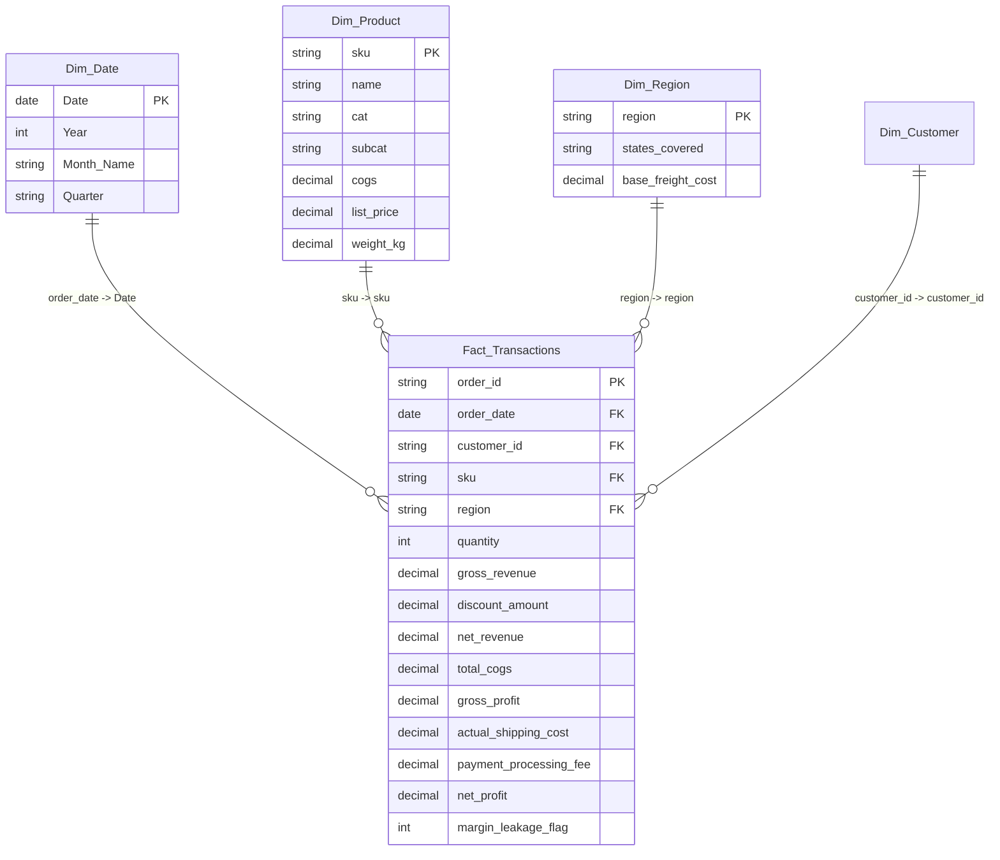

# Power BI Data Model Architecture: E-Commerce Margin Optimization

This document outlines the dimensional schema, relationships, and model design for the E-Commerce Power BI dashboard.

---

## 1. Relational Star Schema Model

---

## 2. Table Cardinalities & Cross-Filtering

| Parent Dimension | Child Fact Table | Join Key | Cardinality | Filter Direction |
| :--- | :--- | :--- | :--- | :--- |
| `Dim_Product` | `Fact_Transactions` | `sku` | **1 : Many (1:*)** | Single |
| `Dim_Date` | `Fact_Transactions` | `Date` $\to$ `order_date` | **1 : Many (1:*)** | Single |
| `Dim_Region` | `Fact_Transactions` | `region` | **1 : Many (1:*)** | Single |
