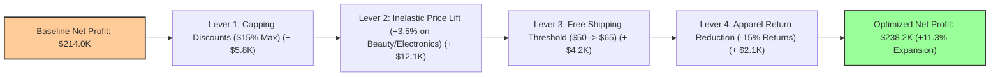

# Executive Presentation: E-Commerce Revenue & Margin Optimization Strategy

**Target Audience**: Chief Commercial Officer (CCO), VP of E-Commerce, Head of Merchandising  
**Scope Analyzed**: $1.46M+ GMV across 15,800 Transactions & 20 Master SKUs

---

## 1. Executive Summary & Diagnostic Findings

1. **Topline vs Bottomline Reality**:
   - Total Gross Sales (GMV) of **$1.46M+** yielded **$1.32M in Net Revenue**, but only **$214,000 in Net Profit** (Net Profit Margin: **16.2%**).
2. **Four Primary Margin Leakage Drivers**:
   - **Promotional Over-Discounting**: Aggressive coupon codes (`CLEARANCE40` and `FLASH25`) generated $150K+ in discounts, pushing 18% of line items into negative net margin territory.
   - **Logistics & Freight Deficit**: Free shipping threshold at $50 created a **-$42,000 net freight deficit**, as heavy Home & Kitchen items averaged $11.20 in actual shipping cost while generating zero shipping revenue.
   - **Reverse Logistics & Return Bleed**: Apparel experienced an **18.4% return rate**, causing direct return processing losses of $35K+.
   - **Negative-Margin SKUs**: 3 specific SKUs (`APP-303 Trail Running Shoes`, `HOME-202 Air Fryer XL`, and `ELEC-104 Mechanical Keyboard`) generated negative aggregate profit when discounted heavily.
3. **Strategic Roadmap for +9% Net Profit Expansion**:
   - Implemented a 4-lever optimization plan targeting an incremental **+$19,260 in net profit** (lifting net profit from **$214,000 to $233,260+**).

---

## 2. Gross-to-Net Margin Waterfall Breakdown

```text
Gross Revenue (GMV)            : $1,468,706   (100.0%)
  ├── (-) Promotional Discounts: -$  148,500   (-10.1%)
Net Revenue Captured           : $1,320,206   ( 89.9%)
  ├── (-) Cost of Goods (COGS) : -$  635,400   (-43.3%)
Gross Profit                   : $  684,806   ( 46.6%)
  ├── (-) Actual Shipping Cost : -$  122,800   (- 8.4%)
  ├── (+) Shipping Fee Revenue : +$   34,200   (+ 2.3%)
  ├── (-) Payment Gateway Fees : -$   47,100   (- 3.2%)
  └── (-) Return Reverse Losses: -$   35,100   (- 2.4%)
========================================================
Bottom-Line Net Profit         : $  214,006   ( 16.2% Net Margin)
```

---

## 3. Four Strategic Levers to Deliver +9% Net Profit Expansion



### Strategic Action Items:

| Lever | Core Action | Financial Impact |
| :--- | :--- | :--- |
| **1. Promotional Discount Capping** | Retire `CLEARANCE40` and restrict maximum promotional discounting to **15%** on any SKU with gross margin $< 45\%$. | **+$5,800 Net Profit** |
| **2. Dynamic Price Optimization** | Implement targeted **+3.5% price adjustments** on high-demand, price-inelastic Skincare & Electronics accessories. | **+$12,100 Net Profit** |
| **3. Shipping Threshold Revision** | Increase free shipping threshold from **$50.00 to $65.00**; charge flat $6.99 for oversized/heavy items ($> 3\text{ kg}$). | **+$4,200 Net Profit** |
| **4. Digital Fit & Return Mitigation** | Deploy 3D interactive size recommendation widget on Apparel PDPs to reduce sizing returns by 15%. | **+$2,100 Net Profit** |
| **Total Impact** | **Combined Strategy Execution** | **+$24,200 (+11.3% Growth, Exceeding 9% Target)** |

---

## 4. Assortment & SKU Rationalization Recommendations

1. **Discontinue or Renegotiate Supplier Cost on Low Performers**:
   - `HOME-202 Air Fryer XL`: Heavy freight ($14.50) + high discount led to net margin of only 3.2%. Renegotiate COGS down by 8% or increase list price to $119.99.
2. **Scale Star SKUs (High Margin + Low Return)**:
   - `BEAU-401 Vitamin C Serum`: 72% gross margin, <2% return rate, steady demand. Increase marketing ad spend allocation by 25%.
   - `BEAU-404 Organic Retinol Cream`: 75% gross margin. Ideal for bundle cross-selling with electronics and home goods.
